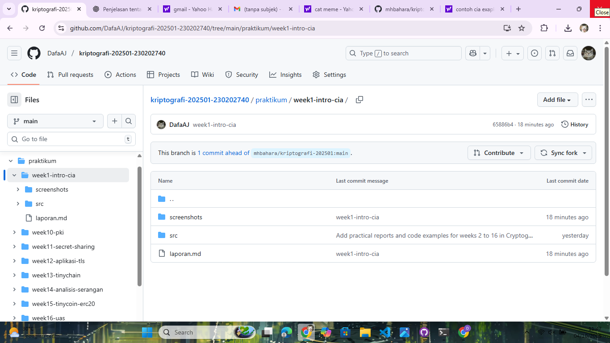
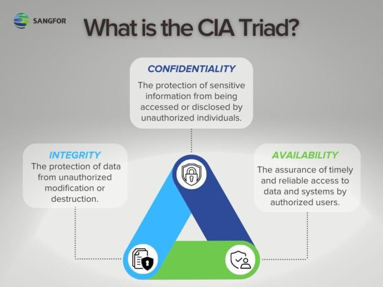

# Laporan Praktikum Kriptografi
Minggu ke-: 01  
Topik: Sejarah Kriptografi & Prinsip CIA  
Nama: Dafa Afriza Julianto  
NIM: 230202740  
Kelas: 5IKRB  

---

## 1. Tujuan
- Menjelaskan sejarah dan evolusi kriptografi dari masa klasik hingga modern.  
- Menyebutkan prinsip Confidentiality, Integrity, Availability (CIA) dengan benar.  
- Menyimpulkan peran kriptografi dalam sistem keamanan informasi modern.  
- Menyiapkan repositori GitHub sebagai media kerja praktikum.

---

## 2. Dasar Teori
Kriptografi merupakan ilmu yang mempelajari teknik untuk mengamankan pesan dengan cara menyandikan informasi sehingga tidak dapat dipahami oleh pihak yang tidak berwenang. Pada masa klasik, metode kriptografi sederhana seperti Caesar Cipher dan Vigenère Cipher digunakan untuk menyamarkan pesan. Prinsip utama cipher klasik adalah melakukan substitusi (penggantian huruf dengan huruf lain) atau transposisi (pertukaran posisi huruf) agar pesan asli (plaintext) sulit dibaca tanpa kunci tertentu.

Selain itu, kriptografi juga memanfaatkan konsep aritmetika modular. Operasi ini digunakan dalam berbagai algoritma enkripsi, baik klasik maupun modern. Contohnya, pada Caesar Cipher, setiap huruf di geser sejauh n posisi menggunakan perhitungan mod 26 (jumlah huruf alfabet). Prinsip ini juga menjadi dasar dalam sistem kriptografi modern seperti RSA yang menggunakan modulus bilangan prima sangat besar agar sulit dipecahkan.

Di era modern, kriptografi tidak hanya fokus pada penyandian pesan, tetapi juga menjamin aspek Confidentiality, Integrity, dan Availability (CIA). Misalnya, algoritma AES (Advanced Encryption Standard) digunakan untuk menjaga kerahasiaan data, sedangkan fungsi hash seperti SHA-256 digunakan untuk memastikan integritas data. Seiring perkembangan teknologi digital, kriptografi menjadi pilar utama dalam keamanan sistem informasi, komunikasi internet, transaksi keuangan, hingga tanda tangan digital.

---

## 3. Alat dan Bahan
(- Python 3.12.10  
- Visual Studio Code / editor lain  
- Git dan akun GitHub  
- Library tambahan (misalnya pycryptodome, jika diperlukan)  )

---

## 4. Langkah Percobaan
(Tuliskan langkah yang dilakukan sesuai instruksi.  
Contoh format:
1. Membuat file `code-example.py` di folder `praktikum/week1-intro-cia/src/`.
2. Menyalin kode program dari panduan praktikum.
3. Menjalankan program dengan perintah `python caesar_cipher.py`.)

---

## 5. Source Code
(Salin kode program utama yang dibuat atau dimodifikasi.  
Gunakan blok kode:

```python
# contoh potongan kode
def encrypt(text, key):
    return ...
```
)

---

## 6. Hasil dan Pembahasan
(- Lampirkan screenshot hasil eksekusi program (taruh di folder `screenshots/`).  
- Berikan tabel atau ringkasan hasil uji jika diperlukan.  
- Jelaskan apakah hasil sesuai ekspektasi.  
- Bahas error (jika ada) dan solusinya. 

Bukti repo dan contoh CIA:



)

---

## 7. Jawaban Pertanyaan
(Jawab pertanyaan diskusi yang diberikan pada modul.  
- Pertanyaan 1: Siapa tokoh yang dianggap sebagai bapak kriptografi modern?
  Jawab       : Claude Shannon.

- Pertanyaan 2: Sebutkan algoritma kunci publik yang populer digunakan saat ini.
  Jawab       : RSA (Rivest–Shamir–Adleman).

- Pertanyaan 3: Apa perbedaan utama antara kriptografi klasik dan kriptografi modern?
  Jawab       : Kriptografi klasik menggunakan teknik substitusi/permutasi sederhana, sedangkan kriptografi modern menggunakan algoritma matematis kompleks, kunci panjang, serta mendukung sistem kunci publik dan privat.
)
---

## 8. Kesimpulan
Praktikum minggu pertama menekankan pemahaman sejarah kriptografi dari era klasik hingga modern serta penerapannya dalam keamanan informasi digital. Mahasiswa memahami prinsip CIA (Confidentiality, Integrity, Availability) sebagai dasar melindungi data dan sistem. Materi ini menjadi fondasi untuk memahami algoritma kriptografi dan teknik enkripsi pada praktikum selanjutnya.

---

## 9. Daftar Pustaka  
- Katz, Jonathan, & Lindell, Yehuda. (2020). Introduction to Modern Cryptography (3rd ed.). CRC Press.
- Stallings, William. (2017). Cryptography and Network Security: Principles and Practice (7th ed.). Pearson Education.
- Menezes, Alfred J., van Oorschot, Paul C., & Vanstone, Scott A. (1996). Handbook of Applied Cryptography. CRC Press.
- Diffie, Whitfield, & Hellman, Martin E. (1976). New Directions in Cryptography. IEEE Transactions on Information Theory, 22(6), 644–654.

---

## 10. Commit Log
(Tuliskan bukti commit Git yang relevan.  
Contoh:
```
commit abc12345
Author: Nama Mahasiswa <email>
Date:   2025-09-20

    week2-cryptosystem: implementasi Caesar Cipher dan laporan )
```
