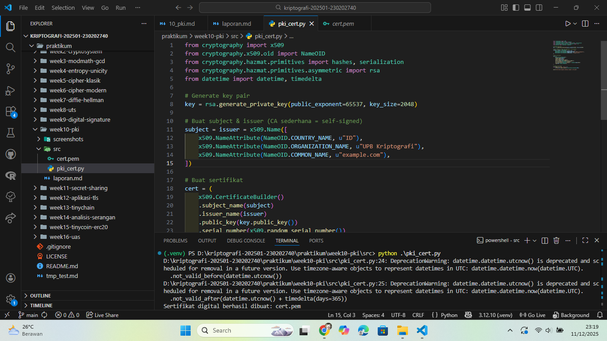
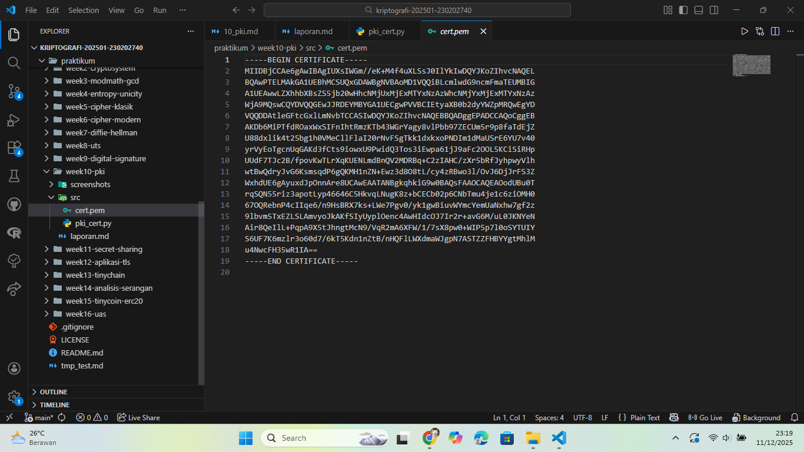

# Laporan Praktikum Kriptografi
Minggu ke-: 10  
Topik: Public Key Infrastructure (PKI & Certificate Authority)  
Nama: Dafa Afriza Julianto  
NIM: 230202740  
Kelas: 5IKRB  

---

## 1. Tujuan
1. Membuat sertifikat digital sederhana.  
2. Menjelaskan peran Certificate Authority (CA) dalam sistem PKI.  
3. Mengevaluasi fungsi PKI dalam komunikasi aman (contoh: HTTPS, TLS). 

---

## 2. Dasar Teori
Public Key Infrastructure (PKI) adalah sistem yang digunakan untuk mengelola pasangan kunci publik–privat serta menerbitkan sertifikat digital. Sertifikat digital mengikat identitas (nama domain, organisasi, negara) dengan sebuah public key, dan biasanya diterbitkan oleh Certificate Authority (CA). PKI memastikan bahwa entitas yang terhubung dalam komunikasi memiliki identitas yang sah dan dapat dipercaya.

Certificate Authority (CA) adalah lembaga terpercaya yang bertugas menerbitkan dan memverifikasi sertifikat digital. CA menandatangani sertifikat menggunakan private key mereka sehingga browser atau sistem lain dapat memverifikasi sertifikat tersebut menggunakan public key CA. Dengan cara ini, PKI mendukung keaslian, integritas, dan non-repudiation dalam komunikasi aman.

Sertifikat digital banyak digunakan dalam HTTPS/TLS. Ketika pengguna mengakses situs web, browser memeriksa apakah sertifikat situs tersebut valid, tidak kedaluwarsa, tidak dicabut, dan ditandatangani oleh CA yang terpercaya. Tanpa PKI, komunikasi online rawan terhadap serangan seperti man-in-the-middle (MITM) atau spoofing.

---

## 3. Alat dan Bahan
(- Python 3.12.10  
- Visual Studio Code / editor lain  
- Git dan akun GitHub  
- Library tambahan (cryptography dan pyOpenSSL)  )

---

## 4. Langkah Percobaan
(Tuliskan langkah yang dilakukan sesuai instruksi.  
Contoh format:
1. Membuat file `pki_cert.py` di folder `praktikum/week10-pki/src/`.
2. Menyalin kode program dari panduan praktikum.
3. Menjalankan program dengan perintah `python pki_cert.py`.)

---

## 5. Source Code
(Salin kode program utama yang dibuat atau dimodifikasi.  
Gunakan blok kode:

```python
from cryptography import x509
from cryptography.x509.oid import NameOID
from cryptography.hazmat.primitives import hashes, serialization
from cryptography.hazmat.primitives.asymmetric import rsa
from datetime import datetime, timedelta

# Generate key pair
key = rsa.generate_private_key(public_exponent=65537, key_size=2048)

# Buat subject & issuer (CA sederhana = self-signed)
subject = issuer = x509.Name([
    x509.NameAttribute(NameOID.COUNTRY_NAME, u"ID"),
    x509.NameAttribute(NameOID.ORGANIZATION_NAME, u"UPB Kriptografi"),
    x509.NameAttribute(NameOID.COMMON_NAME, u"example.com"),
])

# Buat sertifikat
cert = (
    x509.CertificateBuilder()
    .subject_name(subject)
    .issuer_name(issuer)
    .public_key(key.public_key())
    .serial_number(x509.random_serial_number())
    .not_valid_before(datetime.utcnow())
    .not_valid_after(datetime.utcnow() + timedelta(days=365))
    .sign(key, hashes.SHA256())
)

# Simpan sertifikat
with open("cert.pem", "wb") as f:
    f.write(cert.public_bytes(serialization.Encoding.PEM))

print("Sertifikat digital berhasil dibuat: cert.pem")
```
)

---

## 6. Hasil dan Pembahasan
(- Lampirkan screenshot hasil eksekusi program (taruh di folder `screenshots/`).  
- Berikan tabel atau ringkasan hasil uji jika diperlukan.  
- Jelaskan apakah hasil sesuai ekspektasi.  
- Bahas error (jika ada) dan solusinya. 

Hasil eksekusi program Caesar Cipher:



)

---

## 7. Jawaban Pertanyaan
- Pertanyaan 1: Apa fungsi utama Certificate Authority (CA)?  
  CA berfungsi sebagai pihak tepercaya yang menerbitkan dan memvalidasi sertifikat digital. CA mengikat identitas pemilik sertifikat dengan public key, lalu menandatangani sertifikat tersebut sehingga sistem lain dapat memverifikasi keasliannya.
- Pertanyaan 2: Mengapa self-signed certificate tidak cukup untuk sistem produksi?    
  Karena self-signed certificate tidak ditandatangani CA tepercaya. Browser atau sistem lain tidak dapat memastikan apakah sertifikat tersebut berasal dari sumber sah, sehingga rawan spoofing dan serangan MITM. Sertifikat produksi harus diterbitkan oleh CA resmi.
- Pertanyaan 3: Bagaimana PKI mencegah serangan MITM dalam komunikasi TLS/HTTPS?  
  PKI menyediakan cara bagi browser untuk memverifikasi identitas server melalui sertifikat digital. Jika penyerang mencoba menyisipkan sertifikat palsu, browser akan menolak karena tidak ditandatangani CA tepercaya. Dengan demikian, MITM gagal karena penyerang tidak memiliki private key server yang sah.

---

## 8. Kesimpulan
Pada praktikum ini berhasil dibuat sertifikat digital sederhana menggunakan library cryptography. Proses pembuatan dan pembacaan sertifikat memberikan pemahaman bahwa PKI sangat penting dalam komunikasi aman, terutama untuk validasi identitas dan pencegahan serangan MITM. Peran CA sangat krusial karena menjadi sumber kepercayaan utama dalam ekosistem PKI.

---

## 9. Daftar Pustaka
(Cantumkan referensi yang digunakan.  
Contoh:  
- Katz, J., & Lindell, Y. *Introduction to Modern Cryptography*.  
- Stallings, W. *Cryptography and Network Security*.  )

---

## 10. Commit Log
(Tuliskan bukti commit Git yang relevan.  
Contoh:
```
commit abc12345
Author: Nama Mahasiswa <email>
Date:   2025-09-20

    week2-cryptosystem: implementasi Caesar Cipher dan laporan )
```
