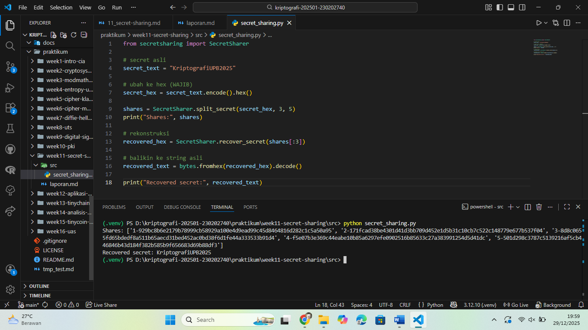
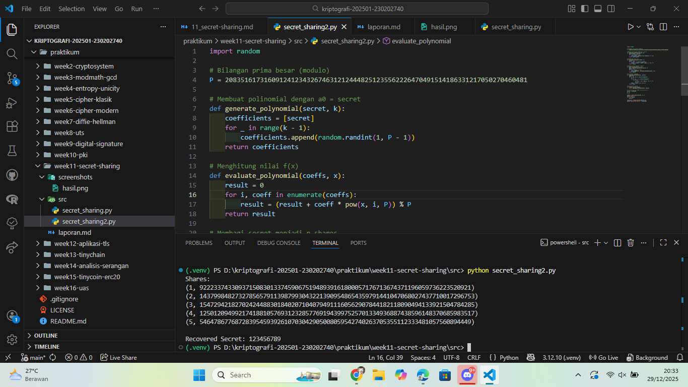

# Laporan Praktikum Kriptografi
Minggu ke-: 11  
Topik: Secret Sharing (Shamir’s Secret Sharing)  
Nama: Dafa Afriza Julianto  
NIM: 230202740  
Kelas: 5IKRB  

---

## 1. Tujuan
1. Menjelaskan konsep **Shamir Secret Sharing** (SSS).  
2. Melakukan simulasi pembagian rahasia ke beberapa pihak menggunakan skema SSS.  
3. Menganalisis keamanan skema distribusi rahasia.  

---

## 2. Dasar Teori
Shamir’s Secret Sharing (SSS) merupakan skema kriptografi yang digunakan untuk membagi sebuah rahasia menjadi beberapa bagian (shares) sehingga rahasia tersebut hanya dapat direkonstruksi jika jumlah minimal bagian tertentu (threshold) terpenuhi. Skema ini diperkenalkan oleh Adi Shamir pada tahun 1979 dan berbasis pada sifat matematis interpolasi polinomial.

Prinsip dasar SSS adalah membangun sebuah polinomial berderajat (k−1) di dalam aritmetika modular, di mana konstanta polinomial (a₀) merepresentasikan rahasia. Setiap peserta menerima satu titik (x, f(x)) dari polinomial tersebut sebagai share. Tanpa minimal k titik, polinomial tidak dapat direkonstruksi sehingga rahasia tetap aman.

Keamanan Shamir Secret Sharing bersifat information-theoretic secure, artinya pihak yang memiliki kurang dari k share tidak memperoleh informasi apa pun tentang rahasia. Skema ini banyak digunakan dalam manajemen kunci kriptografi, sistem pemulihan data, serta pengamanan aset digital seperti dompet cryptocurrency.

---

## 3. Alat dan Bahan
- Python 3.12.10  
- Visual Studio Code / editor lain  
- Git dan akun GitHub  
- Library tambahan (secretsharing)  

---

## 4. Langkah Percobaan
(Tuliskan langkah yang dilakukan sesuai instruksi.  
Contoh format:
1. Membuat file `secret_sharing.py` di folder `praktikum/week11-secret-sharing/src/`.
2. Menyalin kode program dari panduan praktikum.
3. Menjalankan program dengan perintah `python secret_sharing.py`.)

---

## 5. Source Code

### Langkah 1 — Implementasi Shamir Secret Sharing

```python
from secretsharing import SecretSharer

# secret asli
secret_text = "KriptografiUPB2025"

# ubah ke hex (WAJIB)
secret_hex = secret_text.encode().hex()

shares = SecretSharer.split_secret(secret_hex, 3, 5)
print("Shares:", shares)

# rekonstruksi
recovered_hex = SecretSharer.recover_secret(shares[:3])

# balikin ke string asli
recovered_text = bytes.fromhex(recovered_hex).decode()

print("Recovered secret:", recovered_text)
```

### Langkah 2 — Simulasi Manual (Tanpa Library)
implementasi manual
```python
import random

# Bilangan prima besar (modulo)
P = 208351617316091241234326746312124448251235562226470491514186331217050270460481

# Membuat polinomial dengan a0 = secret
def generate_polynomial(secret, k):
    coefficients = [secret]
    for _ in range(k - 1):
        coefficients.append(random.randint(1, P - 1))
    return coefficients

# Menghitung nilai f(x)
def evaluate_polynomial(coeffs, x):
    result = 0
    for i, coeff in enumerate(coeffs):
        result = (result + coeff * pow(x, i, P)) % P
    return result

# Membagi secret menjadi n shares
def split_secret(secret, k, n):
    poly = generate_polynomial(secret, k)
    shares = []
    for i in range(1, n + 1):
        shares.append((i, evaluate_polynomial(poly, i)))
    return shares

# Interpolasi Lagrange
def lagrange_interpolation(x, points):
    total = 0
    for i, (xi, yi) in enumerate(points):
        li = 1
        for j, (xj, _) in enumerate(points):
            if i != j:
                li *= (x - xj) * pow(xi - xj, -1, P)
                li %= P
        total = (total + yi * li) % P
    return total

# Rekonstruksi secret
def recover_secret(shares):
    return lagrange_interpolation(0, shares)

# ================= MAIN =================
secret = 123456789
k = 3
n = 5

shares = split_secret(secret, k, n)
print("Shares:")
for s in shares:
    print(s)

recovered = recover_secret(shares[:k])
print("\nRecovered Secret:", recovered)
```

### Langkah 3 — Analisis Keamanan
- Mengapa skema (k, n) aman meskipun sebagian share bocor?  
  Karena Shamir Secret Sharing aman karena kurang dari k share tidak cukup untuk merekonstruksi polinomial yang menyimpan rahasia. Dengan jumlah share yang tidak mencukupi, terdapat tak terhingga kemungkinan polinomial yang valid sehingga informasi tentang rahasia tidak dapat diketahui sama sekali.
- Apa risiko jika threshold k terlalu kecil atau terlalu besar?  
  * Jika k terlalu kecil, maka rahasia lebih mudah direkonstruksi oleh pihak yang tidak berwenang, sehingga tingkat keamanan menurun.
  * Jika k terlalu besar, maka risiko kehilangan rahasia meningkat karena dibutuhkan banyak share untuk rekonstruksi, yang dapat menyulitkan pemulihan data.
- Bagaimana penerapan SSS di dunia nyata (contoh: manajemen kunci cryptocurrency, recovery password)?  
  Shamir Secret Sharing banyak digunakan dalam manajemen kunci kriptografi, seperti pada dompet cryptocurrency multisignature, sistem pemulihan password, dan pengamanan kunci enkripsi pada sistem terdistribusi untuk mencegah single point of failure.

---

## 6. Hasil dan Pembahasan
(- Lampirkan screenshot hasil eksekusi program (taruh di folder `screenshots/`).  
- Berikan tabel atau ringkasan hasil uji jika diperlukan.  
- Jelaskan apakah hasil sesuai ekspektasi.  
- Bahas error (jika ada) dan solusinya. 

Hasil eksekusi program Caesar Cipher:



)

---

## 7. Jawaban Pertanyaan  
- Pertanyaan 1: Apa keuntungan utama Shamir Secret Sharing dibanding membagikan salinan kunci secara langsung?  
  Keuntungan utamanya adalah tidak ada satu pihak pun yang memegang rahasia secara utuh, sehingga kebocoran satu atau beberapa share tidak akan mengungkap rahasia.
- Pertanyaan 2: Apa peran **threshold (k)** dalam keamanan secret sharing?  
  Threshold menentukan jumlah minimal share yang dibutuhkan untuk merekonstruksi rahasia. Nilai k yang tepat memastikan keseimbangan antara keamanan dan ketersediaan.
- Pertanyaan 3: Berikan satu contoh skenario nyata di mana SSS sangat bermanfaat.  
  Shamir Secret Sharing digunakan dalam sistem dompet cryptocurrency multisignature untuk membagi private key ke beberapa pihak demi meningkatkan keamanan.

---

## 8. Kesimpulan
Berdasarkan praktikum yang dilakukan, Shamir’s Secret Sharing terbukti mampu membagi dan merekonstruksi rahasia secara aman menggunakan pendekatan matematis. Skema ini memberikan keamanan tinggi karena rahasia tidak dapat diketahui tanpa jumlah share yang mencukupi.

---

## 9. Daftar Pustaka
(Cantumkan referensi yang digunakan.  
Contoh:  
- Katz, J., & Lindell, Y. *Introduction to Modern Cryptography*.  
- Stallings, W. *Cryptography and Network Security*.  )

---

## 10. Commit Log
(Tuliskan bukti commit Git yang relevan.  
Contoh:
```
commit abc12345
Author: Nama Mahasiswa <email>
Date:   2025-09-20

    week2-cryptosystem: implementasi Caesar Cipher dan laporan )
```