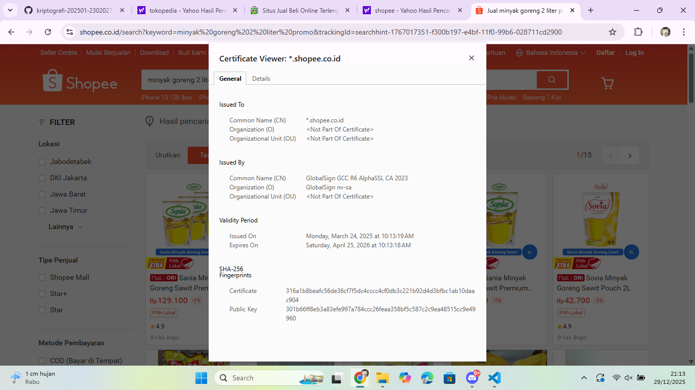

# Laporan Praktikum Kriptografi
Minggu ke-: 12  
Topik: Aplikasi TLS & E-commerce  
Nama: Dafa Afriza Julianto  
NIM: 230202740  
Kelas: 5IKRB  

---

## 1. Tujuan
1. Menganalisis penggunaan kriptografi pada **email** dan **SSL/TLS**.  
2. Menjelaskan enkripsi dalam transaksi **e-commerce**.  
3. Mengevaluasi isu **etika & privasi** dalam penggunaan kriptografi di kehidupan sehari-hari.  

---

## 2. Dasar Teori
Transport Layer Security (TLS) merupakan protokol keamanan yang digunakan untuk melindungi komunikasi data pada jaringan komputer, khususnya pada aplikasi berbasis web dan email. TLS bekerja dengan mengenkripsi data yang dikirimkan antara klien dan server sehingga mencegah pihak ketiga membaca atau memodifikasi informasi tersebut. TLS menggunakan kombinasi kriptografi asimetris, simetris, dan fungsi hash.

Pada website e-commerce, TLS diimplementasikan melalui protokol HTTPS, yang ditandai dengan ikon gembok pada browser. Sertifikat digital yang dikeluarkan oleh Certificate Authority (CA) berfungsi untuk memverifikasi identitas server serta menyediakan kunci publik yang digunakan dalam proses handshake TLS.

Selain aspek teknis, penggunaan kriptografi juga menimbulkan isu etika dan privasi. Enkripsi melindungi data pribadi pengguna, namun di sisi lain dapat menyulitkan proses penegakan hukum dan audit internal jika akses data sepenuhnya tertutup.

---

## 3. Alat dan Bahan
- Browser web (Google Chrome dan Microsoft Edge)  
- Koneksi internet  
- Sistem operasi windows 
- Git dan akun GitHub  

---

## 4. Langkah Percobaan
(Tuliskan langkah yang dilakukan sesuai instruksi.  
Contoh format:
1. Membuat file `caesar_cipher.py` di folder `praktikum/week2-cryptosystem/src/`.
2. Menyalin kode program dari panduan praktikum.
3. Menjalankan program dengan perintah `python caesar_cipher.py`.)

---

## 5. Source Code
Pada praktikum ini tidak digunakan source code, karena fokus kegiatan adalah analisis dan observasi penerapan TLS/SSL pada aplikasi nyata (website dan email).

---

## 6. Hasil dan Pembahasan
(- Lampirkan screenshot hasil eksekusi program (taruh di folder `screenshots/`).  
- Berikan tabel atau ringkasan hasil uji jika diperlukan.  
- Jelaskan apakah hasil sesuai ekspektasi.  
- Bahas error (jika ada) dan solusinya. 

Hasil eksekusi program Caesar Cipher:


)

### Langkah 1 — Analisis SSL/TLS pada Email & Web
Pada tahap ini dilakukan analisis sertifikat SSL/TLS pada website e-commerce Shopee dengan mengamati informasi sertifikat melalui browser. Berdasarkan hasil pengamatan, website Shopee menggunakan protokol HTTPS yang ditandai dengan ikon gembok pada address bar.

Informasi sertifikat yang diperoleh antara lain:
- Domain: *.shopee.co.id
- Certificate Authority (CA): GlobalSign GCC R6 AlphaSSL CA 2023
- Masa berlaku: 24 Maret 2025 hingga 25 April 2026
- Algoritma kriptografi: SHA-256 dengan public key berbasis RSA

Penggunaan HTTPS menunjukkan bahwa komunikasi antara pengguna dan server telah dienkripsi, berbeda dengan HTTP yang tidak menyediakan mekanisme enkripsi sehingga data mudah disadap.

### Langkah 2 — Studi Kasus E-commerce
Pada sistem e-commerce seperti Shopee, TLS digunakan untuk melindungi proses login, transaksi pembayaran, serta pertukaran data pribadi pengguna. Saat pengguna memasukkan username dan password, data tersebut dienkripsi sebelum dikirim ke server sehingga tidak dapat dibaca oleh pihak ketiga.

Jika TLS tidak digunakan, sistem e-commerce rentan terhadap serangan Man-in-the-Middle (MITM), di mana penyerang dapat menyadap atau memodifikasi data transaksi. Hal ini berpotensi menyebabkan pencurian akun dan kebocoran informasi keuangan pengguna.

### Langkah 3 — Analisis Etika & Privasi
Penggunaan enkripsi pada email seperti PGP dan S/MIME bertujuan untuk melindungi privasi komunikasi pengguna. Dengan enkripsi, hanya pengirim dan penerima yang memiliki kunci yang dapat membaca isi pesan.

Namun, hal ini menimbulkan dilema etika, terutama terkait kebijakan perusahaan dan pemerintah. Di satu sisi, enkripsi melindungi hak privasi individu, tetapi di sisi lain dapat menghambat proses audit internal dan penegakan hukum. Oleh karena itu, diperlukan kebijakan yang seimbang antara perlindungan privasi dan kepentingan keamanan.

---

## 7. Jawaban Pertanyaan  
- Pertanyaan 1: Apa perbedaan utama antara HTTP dan HTTPS?  
  HTTP tidak menggunakan enkripsi sehingga data dikirim dalam bentuk teks biasa, sedangkan HTTPS menggunakan TLS untuk mengenkripsi komunikasi sehingga data lebih aman.
- Pertanyaan 2: Mengapa sertifikat digital menjadi penting dalam komunikasi TLS?  
  Sertifikat digital berfungsi untuk memverifikasi identitas server dan mencegah serangan penyamaran (spoofing) dengan memastikan koneksi terhubung ke server yang sah.
- Pertanyaan 3: Bagaimana kriptografi mendukung privasi dalam komunikasi digital, tetapi sekaligus menimbulkan tantangan hukum dan etika?  
  Kriptografi melindungi privasi pengguna dengan enkripsi data, namun dapat menyulitkan pengawasan hukum dan audit perusahaan karena data tidak dapat diakses tanpa kunci dekripsi.

---

## 8. Kesimpulan
Dari praktikum ini dapat disimpulkan bahwa TLS memiliki peran penting dalam menjaga keamanan komunikasi digital, khususnya pada layanan email dan e-commerce. Selain meningkatkan keamanan data, penggunaan kriptografi juga memunculkan tantangan etika dan privasi yang perlu diatur melalui kebijakan yang seimbang.

---

## 9. Daftar Pustaka
(Cantumkan referensi yang digunakan.  
Contoh:  
- Katz, J., & Lindell, Y. *Introduction to Modern Cryptography*.  
- Stallings, W. *Cryptography and Network Security*.  )

---

## 10. Commit Log
```
commit be13c7ea41ed70b7f20c7397298856c7fcf4a301 (HEAD -> main, origin/main, origin/HEAD)
Author: Dafa Afriza J <dafaafrizaj@gmail.com>
Date:   Mon Dec 29 21:38:44 2025 +0700

    week12-aplikasi-tls
```


