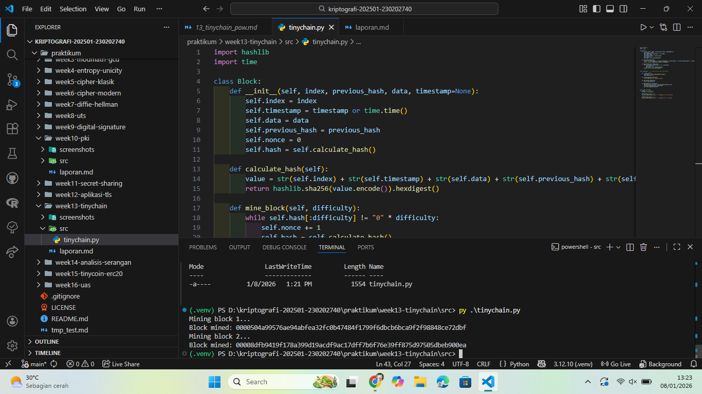

# Laporan Praktikum Kriptografi
Minggu ke-: 13  
Topik: TinyChain – Proof of Work (PoW)  
Nama: Dafa Afriza Julianto  
NIM: 230202740  
Kelas: 5IKRB  

---

## 1. Tujuan
1. Menjelaskan peran **hash function** dalam blockchain.  
2. Melakukan simulasi sederhana **Proof of Work (PoW)**.  
3. Menganalisis keamanan cryptocurrency berbasis kriptografi.

---

## 2. Dasar Teori
Blockchain merupakan teknologi penyimpanan data terdistribusi yang terdiri dari rangkaian blok yang saling terhubung menggunakan fungsi hash kriptografi. Setiap blok menyimpan data transaksi, hash blok sebelumnya, serta hash dari blok itu sendiri sehingga membentuk rantai yang aman dan sulit dimanipulasi.

Fungsi hash kriptografi seperti SHA-256 digunakan untuk menghasilkan nilai hash yang unik dan bersifat satu arah. Perubahan sekecil apapun pada data akan menghasilkan hash yang berbeda secara signifikan. Hal ini menjamin integritas data pada blockchain.

Proof of Work (PoW) merupakan mekanisme konsensus yang mengharuskan penambang untuk memecahkan teka-teki komputasi dengan mencari nilai nonce yang menghasilkan hash sesuai tingkat kesulitan tertentu. Proses ini membutuhkan sumber daya komputasi sehingga membuat manipulasi blockchain menjadi sangat mahal.

---

## 3. Alat dan Bahan
(- Python 3.12.10     
- Visual Studio Code / editor lain  
- Git dan akun GitHub  
- Library tambahan (misalnya pycryptodome, jika diperlukan)  )

---

## 4. Langkah Percobaan
(Tuliskan langkah yang dilakukan sesuai instruksi.  
Contoh format:
1. Membuat file `tinychain.py` di folder `praktikum/week13-tinychain/src/`.
2. Menyalin kode program dari panduan praktikum.
3. Menjalankan program dengan perintah `python tinychain.py`.)

---

## 5. Source Code
(Salin kode program utama yang dibuat atau dimodifikasi.  
Gunakan blok kode:

```python
import hashlib
import time

class Block:
    def __init__(self, index, previous_hash, data, timestamp=None):
        self.index = index
        self.timestamp = timestamp or time.time()
        self.data = data
        self.previous_hash = previous_hash
        self.nonce = 0
        self.hash = self.calculate_hash()

    def calculate_hash(self):
        value = str(self.index) + str(self.timestamp) + str(self.data) + str(self.previous_hash) + str(self.nonce)
        return hashlib.sha256(value.encode()).hexdigest()

    def mine_block(self, difficulty):
        while self.hash[:difficulty] != "0" * difficulty:
            self.nonce += 1
            self.hash = self.calculate_hash()
        print(f"Block mined: {self.hash}")


class Blockchain:  

    def __init__(self):
        self.chain = [self.create_genesis_block()]
        self.difficulty = 4

    def create_genesis_block(self):
        return Block(0, "0", "Genesis Block")

    def get_latest_block(self):
        return self.chain[-1]

    def add_block(self, new_block):
        new_block.previous_hash = self.get_latest_block().hash
        new_block.mine_block(self.difficulty)
        self.chain.append(new_block)


if __name__ == "__main__":
    my_chain = Blockchain()

    print("Mining block 1...")
    my_chain.add_block(Block(1, "", "Transaksi A → B: 10 Coin"))

    print("Mining block 2...")
    my_chain.add_block(Block(2, "", "Transaksi B → C: 5 Coin"))
```
)

---

## 6. Hasil dan Pembahasan
(- Lampirkan screenshot hasil eksekusi program (taruh di folder `screenshots/`).  
- Berikan tabel atau ringkasan hasil uji jika diperlukan.  
- Jelaskan apakah hasil sesuai ekspektasi.  
- Bahas error (jika ada) dan solusinya. 

Hasil eksekusi program Caesar Cipher:


)

---

## 7. Jawaban Pertanyaan  
- Pertanyaan 1: Mengapa fungsi hash sangat penting dalam blockchain?  
  Karena fungsi hash digunakan untuk menjaga integritas data. Setiap blok terhubung dengan hash blok sebelumnya sehingga jika ada perubahan data, seluruh rantai akan rusak dan mudah terdeteksi.
- Pertanyaan 2: Bagaimana Proof of Work mencegah double spending?  
  Proof of Work membuat pemalsuan transaksi menjadi sangat mahal secara komputasi. Untuk mengubah transaksi, penyerang harus menambang ulang seluruh blok setelahnya, yang membutuhkan daya komputasi sangat besar.
- Pertanyaan 3: Apa kelemahan dari PoW dalam hal efisiensi energi?  
  PoW membutuhkan konsumsi listrik yang sangat besar karena proses mining dilakukan secara terus-menerus oleh banyak komputer di seluruh dunia.

---

## 8. Kesimpulan
Praktikum ini menunjukkan bahwa fungsi hash dan Proof of Work merupakan komponen utama dalam keamanan blockchain. Proses mining membutuhkan komputasi tinggi sehingga membuat manipulasi data menjadi sangat sulit dilakukan.

---

## 9. Daftar Pustaka
(Cantumkan referensi yang digunakan.  
Contoh:  
- Katz, J., & Lindell, Y. *Introduction to Modern Cryptography*.  
- Stallings, W. *Cryptography and Network Security*.  )

---

## 10. Commit Log
(Tuliskan bukti commit Git yang relevan.  
Contoh:
```
commit abc12345
Author: Nama Mahasiswa <email>
Date:   2025-09-20

    week2-cryptosystem: implementasi Caesar Cipher dan laporan )
```