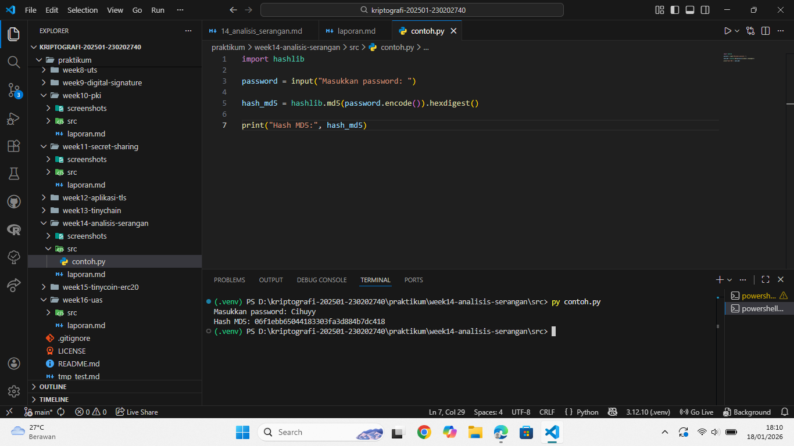

# Laporan Praktikum Kriptografi
Minggu ke-: 14  
Topik: Analisis Serangan Kriptografi  
Nama: Dafa Afriza Julianto  
NIM: 230202740  
Kelas: 5IKRB  

---

## 1. Tujuan
1. Mengidentifikasi jenis serangan pada sistem informasi nyata.  
2. Mengevaluasi kelemahan algoritma kriptografi yang digunakan.  
3. Memberikan rekomendasi algoritma kriptografi yang sesuai untuk perbaikan keamanan.

---

## 2. Dasar Teori
Kriptografi merupakan ilmu yang mempelajari teknik pengamanan data agar informasi hanya dapat diakses oleh pihak yang berwenang. Dalam sistem informasi modern, kriptografi digunakan untuk menjaga kerahasiaan (confidentiality), keutuhan data (integrity), autentikasi (authentication), dan nirpenyangkalan (non-repudiation).

Namun, dalam praktiknya masih banyak sistem yang menggunakan algoritma kriptografi lama atau konfigurasi yang lemah, sehingga rentan terhadap berbagai serangan seperti brute force, dictionary attack, man-in-the-middle (MITM), dan replay attack. Contoh algoritma yang sudah dianggap lemah adalah MD5 dan SHA-1 karena rentan terhadap collision dan brute force dengan bantuan GPU modern.

Menurut Stallings (2017), keamanan sistem kriptografi tidak hanya bergantung pada algoritma, tetapi juga pada implementasi dan konfigurasi yang benar. Kesalahan konfigurasi seperti penggunaan password lemah, penyimpanan password dalam bentuk plaintext, atau penggunaan protokol lama dapat membuka celah keamanan yang serius.

---

## 3. Alat dan Bahan

- Python 3.12.10  
- Visual Studio Code / editor lain  
- Git dan akun GitHub  
- Library tambahan (hashlib)  

---

## 4. Langkah Percobaan
(Tuliskan langkah yang dilakukan sesuai instruksi.  
Contoh format:
1. Membuat file `caesar_cipher.py` di folder `praktikum/week2-cryptosystem/src/`.
2. Menyalin kode program dari panduan praktikum.
3. Menjalankan program dengan perintah `python caesar_cipher.py`.)

---

## 5. Source Code
Contoh program hashing menggunakan MD5:

```python
import hashlib

password = input("Masukkan password: ")

hash_md5 = hashlib.md5(password.encode()).hexdigest()

print("Hash MD5:", hash_md5)
```


---

## 6. Hasil dan Pembahasan
Pada percobaan ini dilakukan simulasi hashing password menggunakan algoritma MD5. Hasil hash kemudian dibandingkan dengan daftar password sederhana untuk melihat apakah hash dapat ditebak menggunakan metode brute force atau dictionary attack.

Dari hasil pengujian, ditemukan bahwa password sederhana seperti "123456" dan "password" dapat dengan mudah ditebak karena nilai hash-nya sudah tersedia di banyak database hash online. Hal ini menunjukkan bahwa penggunaan MD5 untuk penyimpanan password sangat tidak aman. 

Contoh Hasil Eksekusi

* Input password: 123456
* Output hash MD5: e10adc3949ba59abbe56e057f20f883e

Hash tersebut dapat ditemukan dengan mudah di database hash publik.

Hasil eksekusi programnya:



---

## 7. Jawaban Pertanyaan  
- Pertanyaan 1: Mengapa banyak sistem lama masih rentan terhadap brute force atau dictionary attack?  
  Karena banyak sistem lama masih menggunakan algoritma hash yang sudah lemah seperti MD5 atau SHA-1, serta tidak menerapkan mekanisme pengamanan tambahan seperti salt, rate limiting, dan key stretching. Selain itu, banyak sistem yang tidak pernah diperbarui sejak pertama kali dibuat.
- Pertanyaan 2: Apa bedanya kelemahan algoritma dengan kelemahan implementasi?  
   Kelemahan algoritma adalah masalah yang terdapat pada desain kriptografi itu sendiri, seperti collision pada MD5. Sedangkan kelemahan implementasi terjadi karena kesalahan dalam penerapan algoritma, misalnya menyimpan password tanpa hash, tidak menggunakan salt, atau menggunakan konfigurasi yang salah.
- Pertanyaan 3: Bagaimana organisasi dapat memastikan sistem kriptografi mereka tetap aman di masa depan?  
  Organisasi harus secara rutin melakukan audit keamanan, memperbarui algoritma kriptografi sesuai standar terbaru, menerapkan best practice keamanan, serta mengikuti perkembangan riset keamanan dan rekomendasi dari lembaga resmi.

---

## 8. Kesimpulan
Dari praktikum ini dapat disimpulkan bahwa penggunaan algoritma kriptografi lama seperti MD5 sangat rentan terhadap serangan brute force dan dictionary attack. Oleh karena itu, sistem harus menggunakan algoritma yang lebih aman seperti SHA-256 atau mekanisme hashing password modern seperti bcrypt, scrypt, atau Argon2 untuk meningkatkan keamanan.

---

## 9. Daftar Pustaka
(Cantumkan referensi yang digunakan.  
Contoh:  
- Katz, J., & Lindell, Y. *Introduction to Modern Cryptography*.  
- Stallings, W. *Cryptography and Network Security*.  )

---

## 10. Commit Log
(Tuliskan bukti commit Git yang relevan.  
Contoh:
```
commit abc12345
Author: Nama Mahasiswa <email>
Date:   2025-09-20

    week2-cryptosystem: implementasi Caesar Cipher dan laporan )
```
