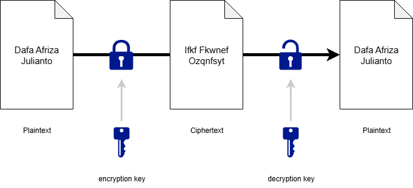
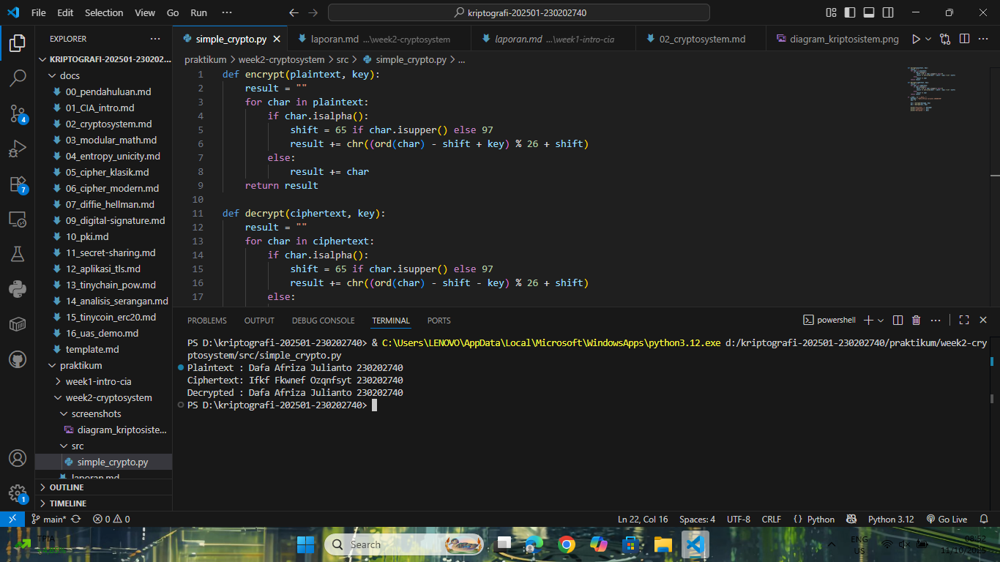

# Laporan Praktikum Kriptografi
Minggu ke-: 02  
Topik: Cryptosystem  
Nama: Dafa Afriza Julianto
NIM: 230202740 
Kelas: 5IKRB 

---

## 1. Tujuan
- Mengidentifikasi komponen dasar kriptosistem (plaintext, ciphertext, kunci, algoritma).
- Menggambarkan proses enkripsi dan dekripsi sederhana.
- Mengklasifikasikan jenis kriptosistem (simetris dan asimetris).

---

## 2. Dasar Teori
Kriptografi adalah ilmu yang mempelajari teknik untuk menjaga kerahasiaan, keaslian, dan integritas data dengan cara mengubah pesan asli (plaintext) menjadi bentuk tidak terbaca (ciphertext). Proses ini disebut enkripsi, sedangkan proses mengembalikan ciphertext ke bentuk semula disebut dekripsi.

Sebuah kriptosistem terdiri dari beberapa komponen utama, yaitu plaintext, ciphertext, algoritma enkripsi/dekripsi, serta kunci (key). Algoritma merupakan aturan atau rumus untuk melakukan transformasi, sedangkan kunci menjadi parameter rahasia yang menentukan hasil enkripsi.

Secara umum, terdapat dua jenis sistem kriptografi, yaitu kriptografi simetris dan kriptografi asimetris. Kriptografi simetris menggunakan satu kunci yang sama untuk enkripsi dan dekripsi, contohnya Caesar Cipher, DES, dan AES. Sementara kriptografi asimetris menggunakan dua kunci berbeda, yaitu public key untuk enkripsi dan private key untuk dekripsi, contohnya RSA dan ECC.

---

## 3. Alat dan Bahan
(- Python 3.12.10  
- Visual Studio Code / editor lain  
- Git dan akun GitHub  
- Library tambahan (misalnya pycryptodome, jika diperlukan)  )

---

## 4. Langkah Percobaan
(Tuliskan langkah yang dilakukan sesuai instruksi.  
Contoh format:
1. Membuat file `simple_crypto.py` di folder `praktikum/week2-cryptosystem/src/`.
2. Menyalin kode program dari panduan praktikum.
3. Menjalankan program dengan perintah `python simple_crypto.py`.)

---

## 5. Source Code
(Salin kode program utama yang dibuat atau dimodifikasi.  
Gunakan blok kode:

```python
def encrypt(plaintext, key):
    result = ""
    for char in plaintext:
        if char.isalpha():
            shift = 65 if char.isupper() else 97
            result += chr((ord(char) - shift + key) % 26 + shift)
        else:
            result += char
    return result

def decrypt(ciphertext, key):
    result = ""
    for char in ciphertext:
        if char.isalpha():
            shift = 65 if char.isupper() else 97
            result += chr((ord(char) - shift - key) % 26 + shift)
        else:
            result += char
    return result

if __name__ == "__main__":
    message = "Dafa Afriza Julianto 230202740"
    key = 5

    enc = encrypt(message, key)
    dec = decrypt(enc, key)

    print("Plaintext :", message)
    print("Ciphertext:", enc)
    print("Decrypted :", dec)
```
)

---

## 6. Hasil dan Pembahasan
(- Lampirkan screenshot hasil eksekusi program (taruh di folder `screenshots/`).  
- Berikan tabel atau ringkasan hasil uji jika diperlukan.  
- Jelaskan apakah hasil sesuai ekspektasi.  
- Bahas error (jika ada) dan solusinya. 

Lampiran diagram kriptosistem dan screenshot hasil eksekusi program Simple Crypto:




Perbedaan Kriptografi Simetris dan Asimetris:

- Kriptografi Simetris menggunakan satu kunci yang sama untuk proses enkripsi dan dekripsi. Artinya, pihak pengirim dan penerima harus memiliki kunci yang identik dan dijaga kerahasiaannya. Sistem ini lebih cepat, namun memiliki kelemahan dalam distribusi kunci.

Contoh algoritma: AES (Advanced Encryption Standard), DES (Data Encryption Standard).

- Kriptografi Asimetris menggunakan dua kunci yang berbeda: satu kunci publik (public key) untuk enkripsi dan satu kunci privat (private key) untuk dekripsi. Sistem ini lebih aman dalam pertukaran kunci, namun prosesnya lebih lambat karena perhitungan matematis yang kompleks.

Contoh algoritma: RSA (Rivest–Shamir–Adleman), ECC (Elliptic Curve Cryptography).
)

---

## 7. Jawaban Pertanyaan 
- Pertanyaan 1: Sebutkan komponen utama dalam sebuah kriptosistem.
  Jawab: 
  Komponen utama dalam kriptosistem meliputi:
    - Plaintext → pesan asli atau data yang belum dienkripsi.
    - Ciphertext → hasil dari proses enkripsi yang tidak dapat dibaca tanpa kunci.
    - Algoritma kriptografi → metode atau prosedur matematis yang digunakan untuk melakukan proses enkripsi dan dekripsi.
    - Kunci (key) → nilai rahasia yang digunakan untuk mengatur atau mengontrol operasi algoritma.

- Pertanyaan 2: Apa kelebihan dan kelemahan sistem simetris dibandingkan asimetris?  
  Jawab: 
  Kelebihan sistem simetris adalah proses enkripsi dan dekripsinya jauh lebih cepat karena hanya menggunakan satu kunci yang sama. Sistem ini efisien dan cocok digunakan untuk mengamankan data dalam jumlah besar atau komunikasi yang membutuhkan kecepatan tinggi. Sedangkan sistem asimetris memiliki kelebihan pada tingkat keamanan yang lebih tinggi, karena menggunakan dua kunci berbeda, yaitu kunci publik untuk enkripsi dan kunci privat untuk dekripsi. Hal ini membuat proses pertukaran kunci menjadi lebih aman.

  Namun, sistem simetris memiliki kelemahan utama dalam hal distribusi kunci, karena kedua pihak harus menyimpan dan mengirim kunci yang sama secara rahasia. Jika kunci tersebut bocor, keamanan seluruh pesan dapat terancam. Sementara sistem asimetris memiliki kelemahan pada performa, karena perhitungan matematisnya lebih kompleks sehingga proses enkripsi dan dekripsi menjadi lebih lambat dibandingkan sistem simetris.

- Pertannyaan 3: Mengapa distribusi kunci menjadi masalah utama dalam kriptografi simetris?
  Jawab:
  Karena distribusi kunci menjadi masalah utama karena kedua pihak (pengirim dan penerima) harus memiliki kunci yang sama, dan proses pengiriman kunci tersebut harus dilakukan secara aman dan rahasia. Jika kunci berhasil disadap oleh pihak ketiga selama proses distribusi, maka seluruh komunikasi dapat dibaca oleh penyusup.

---

## 8. Kesimpulan
Dari hasil praktikum yang telah dilakukan, dapat disimpulkan bahwa proses enkripsi dan dekripsi merupakan inti dari sistem kriptografi. Enkripsi berfungsi untuk mengubah plaintext menjadi ciphertext agar pesan tidak dapat dibaca oleh pihak yang tidak berwenang, sedangkan dekripsi digunakan untuk mengembalikan ciphertext menjadi plaintext semula dengan bantuan kunci yang sesuai. Melalui percobaan ini, dipahami bahwa keamanan data sangat bergantung pada algoritma dan kunci yang digunakan dalam proses kriptografi.

---

## 9. Daftar Pustaka
-

---

## 10. Commit Log
commit 5f57b0d51aa492c91dfb34749ed4caa703652451 (HEAD -> main, origin/main, origin/HEAD)
Author: Dafa Afriza J <dafaafrizaj@gmail.com>
Date:   Sat Oct 11 15:27:45 2025 +0700

    feet: update week2-cryptosystem page