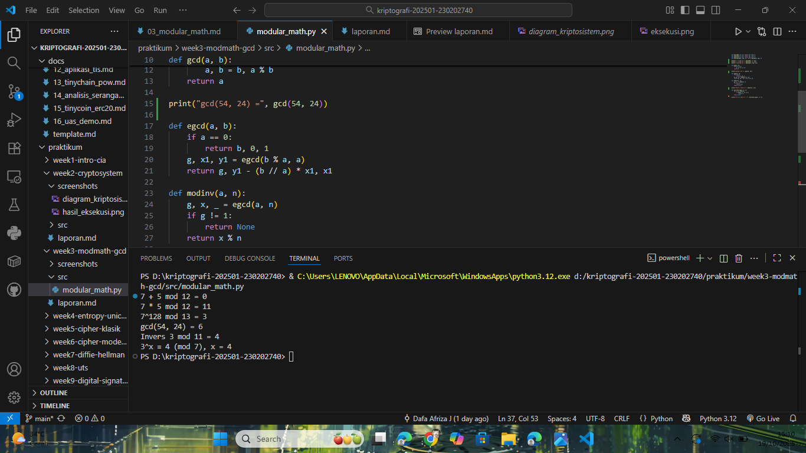

# Laporan Praktikum Kriptografi
Minggu ke-: 3
Topik: Modular Math (Aritmetika Modular, GCD, Bilangan Prima, Logaritma Diskrit) 
Nama: Dafa Afriza Julianto  
NIM: 230202740
Kelas: 5IKRB

---

## 1. Tujuan
1. Menyelesaikan operasi aritmetika modular.  
2. Menentukan bilangan prima dan menghitung GCD (Greatest Common Divisor).  
3. Menerapkan logaritma diskrit sederhana dalam simulasi kriptografi. 

---

## 2. Dasar Teori
Aritmetika modular adalah sistem operasi bilangan yang hasilnya dibatasi oleh modulus tertentu. Operasi dasar seperti penjumlahan, pengurangan, perkalian, dan eksponensiasi dilakukan dengan mengambil sisa hasil bagi terhadap modulus. Konsep ini menjadi pondasi utama dalam sistem kriptografi modern, terutama pada algoritma seperti RSA dan Diffie-Hellman.

Algoritma Euclidean digunakan untuk mencari GCD (Greatest Common Divisor) dari dua bilangan secara efisien. GCD sangat penting dalam teori bilangan karena menentukan apakah dua bilangan saling relatif prima (coprime), yang berperan penting dalam mencari invers modular.

Logaritma diskrit adalah kebalikan dari eksponensiasi modular. Ia mencari nilai 𝑥 yang memenuhi 𝑎<sup>𝑥</sup>≡ 𝑏 (𝑚𝑜𝑑 𝑛). Masalah ini sulit diselesaikan untuk modulus besar, sehingga menjadi dasar keamanan dari banyak algoritma kriptografi modern.

---

## 3. Alat dan Bahan
(- Python 3.12.10 
- Visual Studio Code / editor lain  
- Git dan akun GitHub  
- Library tambahan (misalnya pycryptodome, jika diperlukan)  )

---

## 4. Langkah Percobaan
(Tuliskan langkah yang dilakukan sesuai instruksi.  
Contoh format:
1. Membuat file `modular_math.py` di folder `praktikum/week3-modmath-gcd/src/`.
2. Menyalin kode program dari panduan praktikum.
3. Menjalankan program dengan perintah `python modular_math.py`.)

---

## 5. Source Code
(Salin kode program utama yang dibuat atau dimodifikasi.  
Gunakan blok kode:

```python
def mod_add(a, b, n): return (a + b) % n
def mod_sub(a, b, n): return (a - b) % n
def mod_mul(a, b, n): return (a * b) % n
def mod_exp(base, exp, n): return pow(base, exp, n)

def gcd(a, b):
    while b != 0:
        a, b = b, a % b
    return a

def egcd(a, b):
    if a == 0:
        return b, 0, 1
    g, x1, y1 = egcd(b % a, a)
    return g, y1 - (b // a) * x1, x1

def modinv(a, n):
    g, x, _ = egcd(a, n)
    if g != 1:
        return None
    return x % n

def discrete_log(a, b, n):
    for x in range(n):
        if pow(a, x, n) == b:
            return x
    return None

print("=== Aritmetika Modular ===")
print("7 + 5 mod 12 =", mod_add(7, 5, 12))
print("7 * 5 mod 12 =", mod_mul(7, 5, 12))
print("7^128 mod 13 =", mod_exp(7, 128, 13))

print("\n=== GCD dan Invers Modular ===")
print("gcd(54, 24) =", gcd(54, 24))
print("Invers 3 mod 11 =", modinv(3, 11))

print("\n=== Logaritma Diskrit ===")
print("3^x ≡ 4 (mod 7), x =", discrete_log(3, 4, 7))
```
)

---

## 6. Hasil dan Pembahasan
(- Lampirkan screenshot hasil eksekusi program (taruh di folder `screenshots/`).  
- Berikan tabel atau ringkasan hasil uji jika diperlukan.  
- Jelaskan apakah hasil sesuai ekspektasi.  
- Bahas error (jika ada) dan solusinya. 

Hasil eksekusi program Modular Math:


)

---

## 7. Jawaban Pertanyaan  
- Pertanyaan 1: Apa peran aritmetika modular dalam kriptografi modern?
  Jawab: Aritmetika modular digunakan dalam sistem kriptografi untuk membatasi hasil operasi agar tetap dalam ruang bilangan tertentu. Konsep ini digunakan dalam algoritma RSA, Diffie-Hellman, dan ECC untuk menjaga keamanan melalui operasi eksponensial modular yang sulit dibalik.
- Pertanyaan 2: Mengapa invers modular penting dalam algoritma kunci publik (misalnya RSA)?
  Jawab: Invers modular digunakan untuk menghitung kunci privat dari kunci publik. Dalam RSA, kunci privat 𝑑 adalah invers modular dari 𝑒 terhadap 𝜙(𝑛), yang memungkinkan proses dekripsi pesan.
- Pertanyaan 3: Apa tantangan utama dalam menyelesaikan logaritma diskrit untuk modulus besar?
  Jawab: Tantangannya adalah kompleksitas komputasi yang sangat tinggi. Untuk modulus besar (ratusan atau ribuan bit), mencari nilai 𝑥 yang memenuhi 𝑎<sup>𝑥</sup> ≡ 𝑏(𝑚𝑜𝑑 𝑛) hampir tidak mungkin dilakukan dengan cara brute-force, sehingga menjadi dasar keamanan algoritma seperti Diffie-Hellman.
---

## 8. Kesimpulan
Dari praktikum ini dapat disimpulkan bahwa aritmetika modular merupakan dasar penting dalam kriptografi modern. Algoritma Euclidean dan Extended Euclidean memungkinkan perhitungan GCD serta invers modular secara efisien. Sementara itu, logaritma diskrit menjadi konsep yang sulit dipecahkan dan menjadi dasar keamanan berbagai sistem enkripsi.

---

## 9. Daftar Pustaka
-

---

## 10. Commit Log
(Tuliskan bukti commit Git yang relevan.  
Contoh:
```
commit abc12345
Author: Nama Mahasiswa <email>
Date:   2025-09-20

    week2-cryptosystem: implementasi Caesar Cipher dan laporan )
```
