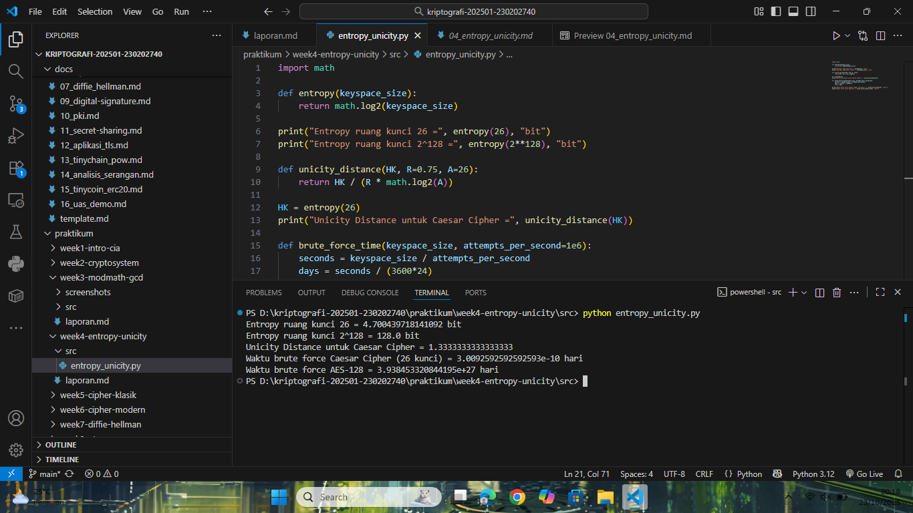

# Laporan Praktikum Kriptografi
Minggu ke-: 4  
Topik: Entropy & Unicity Distance (Evaluasi Kekuatan Kunci dan Brute Force)  
Nama: Dafa Afriza Julianto  
NIM: 230202740  
Kelas: 5IKRB  

---

## 1. Tujuan
1. Menyelesaikan perhitungan sederhana terkait entropi kunci.  
2. Menggunakan teorema Euler pada contoh perhitungan modular & invers.  
3. Menghitung **unicity distance** untuk ciphertext tertentu.  
4. Menganalisis kekuatan kunci berdasarkan entropi dan unicity distance.  
5. Mengevaluasi potensi serangan brute force pada kriptosistem sederhana.  

---

## 2. Dasar Teori
Entropi dalam konteks kriptografi menggambarkan tingkat ketidakpastian atau keacakan dari sebuah kunci. Semakin besar nilai entropi, semakin sulit kunci tersebut ditebak, karena ruang kuncinya lebih luas. Entropi dihitung menggunakan rumus *H*(𝐾) = log₂ |𝐾|, di mana ∣𝐾∣ adalah ukuran ruang kunci.

Unicity distance merupakan ukuran panjang ciphertext minimum yang dibutuhkan agar dapat secara unik menentukan kunci yang digunakan. Rumusnya adalah 𝑈 = 𝐻(𝐾)/ 𝑅⋅log_2 ∣𝐴∣, dengan 𝑅 sebagai redundansi bahasa dan ∣𝐴∣ jumlah alfabet. Semakin besar nilai U, semakin aman cipher terhadap serangan analisis frekuensi.

Brute force attack adalah metode penyerangan dengan mencoba semua kemungkinan kunci sampai ditemukan yang benar. Walaupun sederhana, serangan ini masih menjadi ancaman nyata bila ukuran ruang kunci kecil atau sistem memiliki kelemahan implementasi.

---

## 3. Alat dan Bahan
(- Python 3.12.10  
- Visual Studio Code / editor lain  
- Git dan akun GitHub  
- Library tambahan (math)  )

---

## 4. Langkah Percobaan
(Tuliskan langkah yang dilakukan sesuai instruksi.  
Contoh format:
1. Membuat file `entropy_unicity.py` di folder `praktikum/week4-entropy-unicity/src/`.
2. Menyalin kode program dari panduan praktikum.
3. Menjalankan program dengan perintah `python entropy_unicity.py`.)

---

## 5. Source Code
(Salin kode program utama yang dibuat atau dimodifikasi.  
Gunakan blok kode:

```python
import math

def entropy(keyspace_size):
    return math.log2(keyspace_size)

print("Entropy ruang kunci 26 =", entropy(26), "bit")
print("Entropy ruang kunci 2^128 =", entropy(2**128), "bit")

def unicity_distance(HK, R=0.75, A=26):
    return HK / (R * math.log2(A))

HK = entropy(26)
print("Unicity Distance untuk Caesar Cipher =", unicity_distance(HK))

def brute_force_time(keyspace_size, attempts_per_second=1e6):
    seconds = keyspace_size / attempts_per_second
    days = seconds / (3600*24)
    return days

print("Waktu brute force Caesar Cipher (26 kunci) =", brute_force_time(26), "hari")
print("Waktu brute force AES-128 =", brute_force_time(2**128), "hari")
```
)

---

## 6. Hasil dan Pembahasan
(- Lampirkan screenshot hasil eksekusi program (taruh di folder `screenshots/`).  
- Berikan tabel atau ringkasan hasil uji jika diperlukan.  
- Jelaskan apakah hasil sesuai ekspektasi.  
- Bahas error (jika ada) dan solusinya. 

Hasil eksekusi program Caesar Cipher:


)

---

## 7. Jawaban Pertanyaan  
- Pertanyaan 1: Apa arti dari nilai **entropy** dalam konteks kekuatan kunci?
  Jawab: Entropy menggambarkan seberapa acak dan besar ruang kunci yang tersedia. Semakin tinggi entropi, semakin sulit kunci ditebak dan semakin kuat keamanan cipher-nya.
- Pertanyaan 2: Mengapa unicity distance penting dalam menentukan keamanan suatu cipher? 
  Jawab: Karena unicity distance menunjukkan seberapa banyak ciphertext yang dibutuhkan agar penyerang dapat menemukan kunci dengan pasti. Nilai U yang besar menunjukkan cipher lebih tahan terhadap analisis frekuensi.
- Pertanyaan 3: Mengapa brute force masih menjadi ancaman meskipun algoritma sudah kuat?
  Jawab: Karena brute force tidak bergantung pada kelemahan algoritma, tapi pada ukuran ruang kunci. Jika kunci terlalu pendek atau implementasi lemah, brute force tetap bisa berhasil dalam waktu wajar.  

---

## 8. Kesimpulan
Dari percobaan ini dapat disimpulkan bahwa semakin besar ruang kunci, semakin tinggi nilai entropinya dan semakin aman sistem kriptografinya. Nilai unicity distance juga berperan penting dalam menentukan ketahanan cipher terhadap analisis. Brute force dapat diabaikan untuk algoritma modern seperti AES-128 karena waktu yang dibutuhkan sangat tidak realistis.

---

## 9. Daftar Pustaka
-

---

## 10. Commit Log
(Tuliskan bukti commit Git yang relevan.  
Contoh:
```
commit abc12345
Author: Nama Mahasiswa <email>
Date:   2025-09-20

    week2-cryptosystem: implementasi Caesar Cipher dan laporan )
```
