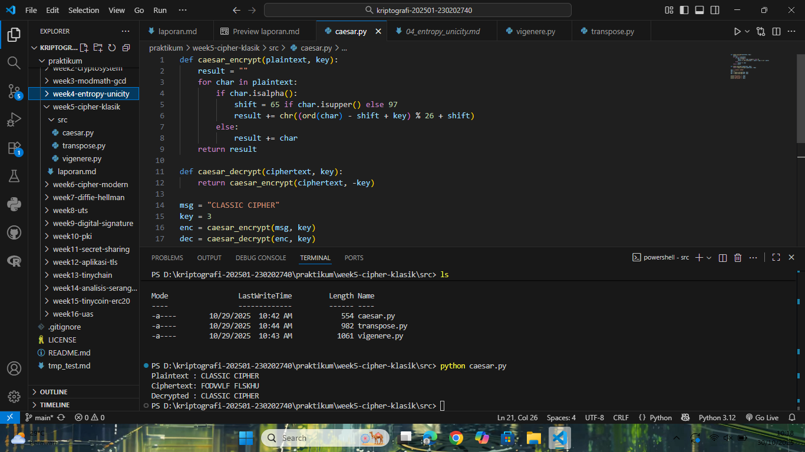
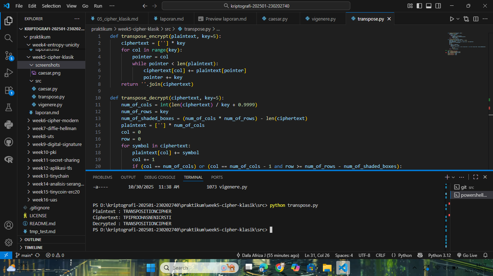
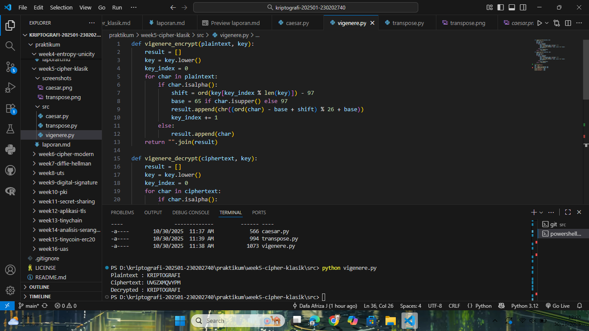

# Laporan Praktikum Kriptografi
Minggu ke-: 5  
Topik: Cipher Klasik (Caesar, Vigenère, Transposisi)  
Nama: Dafa Afriza Julianto  
NIM: 230202740  
Kelas: 5IKRB  

---

## 1. Tujuan
1. Menerapkan algoritma **Caesar Cipher** untuk enkripsi dan dekripsi teks.  
2. Menerapkan algoritma **Vigenère Cipher** dengan variasi kunci.  
3. Mengimplementasikan algoritma transposisi sederhana.  
4. Menjelaskan kelemahan algoritma kriptografi klasik.

---

## 2. Dasar Teori
Cipher klasik merupakan metode kriptografi awal yang digunakan untuk menyembunyikan pesan dengan melakukan pergeseran huruf (substitusi) atau pertukaran posisi karakter (transposisi). Proses enkripsi dan dekripsi pada cipher klasik menggunakan operasi aritmetika modular terhadap alfabet sehingga setiap huruf diubah berdasarkan kunci tertentu.

Caesar Cipher menggantikan setiap huruf dengan huruf lain yang berjarak tetap dari alfabet asli. Misalnya, dengan kunci 3, huruf A diganti menjadi D. Sementara itu, Vigenère Cipher menggunakan kunci berupa kata yang berulang untuk menentukan besar pergeseran tiap huruf sehingga lebih sulit dipecahkan dibanding Caesar Cipher tunggal.

Transposisi Cipher tidak mengganti huruf, tetapi mengubah urutan huruf sesuai pola tertentu. Meski berbeda teknik, cipher klasik memiliki kelemahan mendasar karena pola huruf dan frekuensi masih dapat dianalisis oleh kriptanalisis modern.

---

## 3. Alat dan Bahan
(- Python 3.12.10  
- Visual Studio Code / editor lain  
- Git dan akun GitHub  
- Library tambahan (misalnya pycryptodome, jika diperlukan)  )

---

## 4. Langkah Percobaan
(Tuliskan langkah yang dilakukan sesuai instruksi.  
Contoh format:
1. Membuat file `caesar.py, vigenere.py, transpose.py` di folder `praktikum/week5-cipher-klasik/src/`.
2. Menyalin kode program dari panduan praktikum.
3. Menjalankan program dengan perintah `python caesar.py, python vigenere.py, dan python transpose.py`.)

---

## 5. Source Code
Source Code caesar.py

```python
def caesar_encrypt(plaintext, key):
    result = ""
    for char in plaintext:
        if char.isalpha():
            shift = 65 if char.isupper() else 97
            result += chr((ord(char) - shift + key) % 26 + shift)
        else:
            result += char
    return result

def caesar_decrypt(ciphertext, key):
    return caesar_encrypt(ciphertext, -key)

msg = "CLASSIC CIPHER"
key = 3
enc = caesar_encrypt(msg, key)
dec = caesar_decrypt(enc, key)

print("Plaintext :", msg)
print("Ciphertext:", enc)
print("Decrypted :", dec)
```

Suorce Code transpose.py

```python
def transpose_encrypt(plaintext, key=5):
    ciphertext = [''] * key
    for col in range(key):
        pointer = col
        while pointer < len(plaintext):
            ciphertext[col] += plaintext[pointer]
            pointer += key
    return ''.join(ciphertext)

def transpose_decrypt(ciphertext, key=5):
    num_of_cols = int(len(ciphertext) / key + 0.9999)
    num_of_rows = key
    num_of_shaded_boxes = (num_of_cols * num_of_rows) - len(ciphertext)
    plaintext = [''] * num_of_cols
    col = 0
    row = 0
    for symbol in ciphertext:
        plaintext[col] += symbol
        col += 1
        if (col == num_of_cols) or (col == num_of_cols - 1 and row >= num_of_rows - num_of_shaded_boxes):
            col = 0
            row += 1
    return ''.join(plaintext)

msg = "TRANSPOSITIONCIPHER"
enc = transpose_encrypt(msg, key=5)
dec = transpose_decrypt(enc, key=5)

print("Plaintext :", msg)
print("Ciphertext:", enc)
print("Decrypted :", dec)
```

Suorce Code vigenere.py

```python
def vigenere_encrypt(plaintext, key):
    result = []
    key = key.lower()
    key_index = 0
    for char in plaintext:
        if char.isalpha():
            shift = ord(key[key_index % len(key)]) - 97
            base = 65 if char.isupper() else 97
            result.append(chr((ord(char) - base + shift) % 26 + base))
            key_index += 1
        else:
            result.append(char)
    return "".join(result)

def vigenere_decrypt(ciphertext, key):
    result = []
    key = key.lower()
    key_index = 0
    for char in ciphertext:
        if char.isalpha():
            shift = ord(key[key_index % len(key)]) - 97
            base = 65 if char.isupper() else 97
            result.append(chr((ord(char) - base - shift) % 26 + base))
            key_index += 1
        else:
            result.append(char)
    return "".join(result)

msg = "KRIPTOGRAFI"
key = "KEY"
enc = vigenere_encrypt(msg, key)
dec = vigenere_decrypt(enc, key)

print("Plaintext :", msg)
print("Ciphertext:", enc)
print("Decrypted :", dec)
```

---

## 6. Hasil dan Pembahasan
(- Lampirkan screenshot hasil eksekusi program (taruh di folder `screenshots/`).  
- Berikan tabel atau ringkasan hasil uji jika diperlukan.  
- Jelaskan apakah hasil sesuai ekspektasi.  
- Bahas error (jika ada) dan solusinya. 

Hasil eksekusi program Cipher Klasik:




)

---

## 7. Jawaban Pertanyaan
- Pertanyaan 1: Apa kelemahan utama algoritma Caesar Cipher dan Vigenère Cipher?
  Jawab: Caesar Cipher hanya memiliki 25 kemungkinan kunci sehingga mudah diretas dengan brute force. Vigenère Cipher sedikit lebih kuat karena menggunakan kunci berulang, tetapi tetap rentan terhadap analisis frekuensi dan serangan Kasiski jika panjang kuncinya diketahui.
- Pertanyaan 2: Mengapa cipher klasik mudah diserang dengan analisis frekuensi? 
  Jawab: Karena pola kemunculan huruf pada ciphertext masih mencerminkan pola bahasa aslinya. Huruf yang sering muncul seperti “E” dalam bahasa Inggris tetap memiliki frekuensi tinggi meskipun dienkripsi, sehingga penyerang dapat menebak substitusi huruf. 
- Pertanyaan 3: Bandingkan kelebihan dan kelemahan cipher substitusi vs transposisi.
  Jawab: Cipher substitusi mengganti karakter tetapi mempertahankan urutan, sedangkan cipher transposisi mempertahankan karakter asli namun mengubah urutan. Substitusi lebih sederhana tapi mudah dipetakan dengan analisis frekuensi, sedangkan transposisi lebih sulit dianalisis tapi mudah dipecahkan jika pola pengurutan diketahui.  
---

## 8. Kesimpulan
Praktikum ini menunjukkan bahwa algoritma cipher klasik seperti Caesar Cipher, Vigenère Cipher, dan Transposisi Sederhana dapat diimplementasikan dengan mudah menggunakan bahasa pemrograman Python.
Hasil percobaan membuktikan bahwa proses enkripsi dan dekripsi berhasil dilakukan dengan benar, di mana teks asli dapat dikembalikan sepenuhnya dari ciphertext.
Namun demikian, cipher klasik memiliki kelemahan signifikan karena pola huruf masih dapat dianalisis menggunakan metode kriptanalisis seperti analisis frekuensi, sehingga algoritma ini tidak lagi dianggap aman untuk komunikasi modern.

---

## 9. Daftar Pustaka
- Katz, J., & Lindell, Y. (2015). Introduction to Modern Cryptography (2nd ed.). Chapman & Hall/CRC.
- Stallings, W. (2017). Cryptography and Network Security: Principles and Practice (7th ed.). Pearson Education.
- Schneier, B. (1996). Applied Cryptography: Protocols, Algorithms, and Source Code in C. John Wiley & Sons.
- Munir, R. (2019). Kriptografi (Edisi Revisi). Informatika Bandung.
- Khan, A. (2023). Classical Ciphers in Python: Caesar, Vigenère, and Transposition Explained. Medium Publication on Towards Data Science.

---

## 10. Commit Log
```
commit b6bcceddcb58b37537470b17b9db9928e369d6f1 (HEAD -> main, origin/main, origin/HEAD)
Author: Dafa Afriza J <dafaafrizaj@gmail.com>
Date:   Thu Oct 30 10:51:13 2025 +0700

    week5-cipher-klasik
```