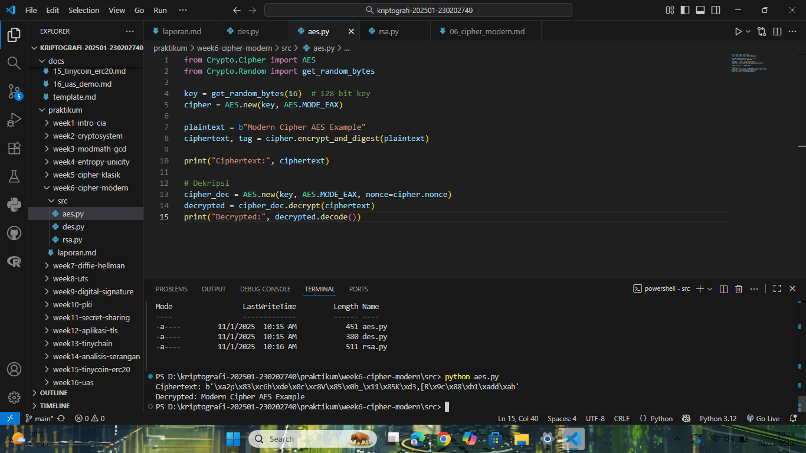
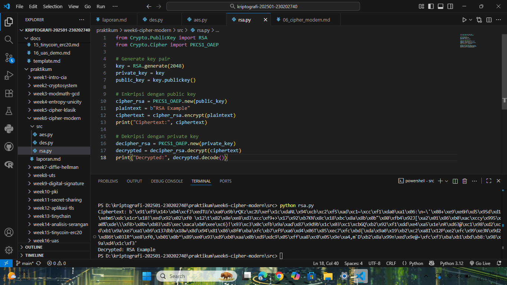

# Laporan Praktikum Kriptografi
Minggu ke-: 6  
Topik: Chiper Modern (DES, AES, RSA)  
Nama: Dafa Afriza Julianto  
NIM: 230202740  
Kelas: 5IKRB  

---

## 1. Tujuan
1. Mengimplementasi algoritma **DES** untuk blok data sederhana.
2. Menerapkan algoritma **AES** dengan panjang kunci 128 bit.
3. Menjelaskan proses pembangkitan kunci publik dan privat pada algoritma **RSA**.

---

## 2. Dasar Teori
Cipher modern merupakan sistem kriptografi yang digunakan untuk melindungi data digital dengan tingkat keamanan tinggi. Berbeda dengan cipher klasik yang berbasis pada substitusi dan transposisi sederhana, cipher modern menggunakan operasi matematika kompleks dan kunci dengan panjang bit yang besar.

DES (Data Encryption Standard) adalah algoritma simetris berbasis blok 64-bit yang menggunakan kunci sepanjang 56 bit. Meskipun dulu menjadi standar, DES kini dianggap kurang aman karena dapat ditembus dengan brute force.

AES (Advanced Encryption Standard) menggantikan DES sebagai standar modern. AES menggunakan ukuran blok 128 bit dan mendukung panjang kunci 128, 192, atau 256 bit. Algoritma ini berbasis operasi substitusi, permutasi, dan transformasi matriks pada Galois Field.

RSA (Rivest–Shamir–Adleman) adalah algoritma asimetris yang menggunakan pasangan kunci publik dan privat. Keamanannya bergantung pada kesulitan faktorisasi bilangan besar. RSA sering digunakan untuk pertukaran kunci atau tanda tangan digital.

---

## 3. Alat dan Bahan
(- Python 3.12.10  
- Visual Studio Code / editor lain  
- Git dan akun GitHub  
- Library tambahan (pycryptodome)  )

---

## 4. Langkah Percobaan
(Tuliskan langkah yang dilakukan sesuai instruksi.  
Contoh format:
1. Membuat file `aes.py, rsa.py, des.py` di folder `praktikum/week6-cipher-modern/src/`.
2. Menyalin kode program dari panduan praktikum.
3. Menjalankan program dengan perintah `python aes.py, python rsa.py, python des.py`.)

---

## 5. Source Code
Source Code des.py

```python
from Crypto.Cipher import DES
from Crypto.Random import get_random_bytes

key = get_random_bytes(8)  # kunci 64 bit (8 byte)
cipher = DES.new(key, DES.MODE_ECB)

plaintext = b"ABCDEFGH"
ciphertext = cipher.encrypt(plaintext)
print("Ciphertext:", ciphertext)

decipher = DES.new(key, DES.MODE_ECB)
decrypted = decipher.decrypt(ciphertext)
print("Decrypted:", decrypted)
```

Source Code aes.py

```python
from Crypto.Cipher import AES
from Crypto.Random import get_random_bytes

key = get_random_bytes(16)  # 128 bit key
cipher = AES.new(key, AES.MODE_EAX)

plaintext = b"Modern Cipher AES Example"
ciphertext, tag = cipher.encrypt_and_digest(plaintext)

print("Ciphertext:", ciphertext)

# Dekripsi
cipher_dec = AES.new(key, AES.MODE_EAX, nonce=cipher.nonce)
decrypted = cipher_dec.decrypt(ciphertext)
print("Decrypted:", decrypted.decode())
```

Source Code rsa.py

```python
from Crypto.PublicKey import RSA
from Crypto.Cipher import PKCS1_OAEP

# Generate key pair
key = RSA.generate(2048)
private_key = key
public_key = key.publickey()

# Enkripsi dengan public key
cipher_rsa = PKCS1_OAEP.new(public_key)
plaintext = b"RSA Example"
ciphertext = cipher_rsa.encrypt(plaintext)
print("Ciphertext:", ciphertext)

# Dekripsi dengan private key
decipher_rsa = PKCS1_OAEP.new(private_key)
decrypted = decipher_rsa.decrypt(ciphertext)
print("Decrypted:", decrypted.decode())
```

---

## 6. Hasil dan Pembahasan
(- Lampirkan screenshot hasil eksekusi program (taruh di folder `screenshots/`).  
- Berikan tabel atau ringkasan hasil uji jika diperlukan.  
- Jelaskan apakah hasil sesuai ekspektasi.  
- Bahas error (jika ada) dan solusinya. 

Hasil eksekusi program Caesar Cipher:




)

---

## 7. Jawaban Pertanyaan
- Pertanyaan 1: Apa perbedaan mendasar antara DES, AES, dan RSA dalam hal kunci dan keamanan?
  Jawab: DES dan AES termasuk algoritma simetris, menggunakan satu kunci yang sama untuk enkripsi dan dekripsi. RSA termasuk asimetris, memakai pasangan kunci publik dan privat. Dari segi keamanan, AES jauh lebih kuat daripada DES karena panjang kuncinya lebih besar (128–256 bit), sedangkan RSA mengandalkan kompleksitas faktorisasi bilangan besar.
- Pertanyaan 2: Mengapa AES lebih banyak digunakan dibanding DES di era modern? 
  Jawab: Karena AES memiliki kecepatan yang lebih tinggi, efisiensi yang lebih baik pada perangkat keras maupun lunak, serta tingkat keamanan yang jauh lebih tinggi. DES sudah dapat ditembus dengan brute force, sedangkan AES masih sangat aman hingga saat ini. 
- Pertanyaan 3: Mengapa RSA dikategorikan sebagai algoritma asimetris, dan bagaimana proses pembangkitan kuncinya?
  Jawab: RSA disebut asimetris karena menggunakan dua kunci berbeda: kunci publik untuk enkripsi dan kunci privat untuk dekripsi. Proses pembangkitan kuncinya dilakukan dengan memilih dua bilangan prima besar (p dan q), menghitung modulus 𝑛 = 𝑝 × 𝑞, menentukan eksponen publik 𝑒, dan menghitung eksponen privat 𝑑 sebagai invers dari 𝑒 terhadap 𝜙(𝑛).  

---

## 8. Kesimpulan
Dari percobaan ini dapat disimpulkan bahwa algoritma DES, AES, dan RSA memiliki perbedaan mendasar pada jenis kunci dan tingkat keamanan. AES dan DES merupakan cipher simetris, sedangkan RSA adalah cipher asimetris. AES lebih unggul dalam efisiensi dan keamanan modern, sementara RSA penting dalam sistem autentikasi dan distribusi kunci.

---

## 9. Daftar Pustaka
-

---

## 10. Commit Log
(Tuliskan bukti commit Git yang relevan.  
Contoh:
```
commit abc12345
Author: Nama Mahasiswa <email>
Date:   2025-09-20

    week2-cryptosystem: implementasi Caesar Cipher dan laporan )
```
