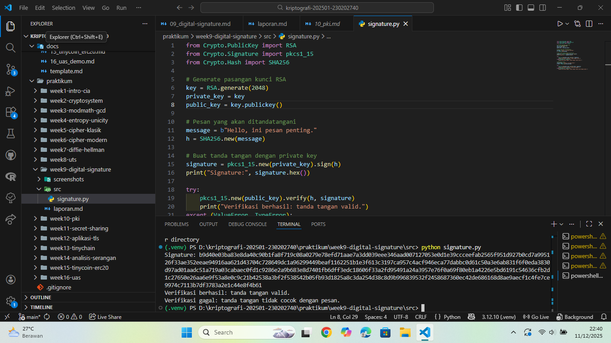

# Laporan Praktikum Kriptografi
Minggu ke-: 9  
Topik: Digital Signature (RSA/DSA)  
Nama: Dafa Afriza Julianto  
NIM: 230202740  
Kelas: 5IKRB  

---

## 1. Tujuan
1. Mengimplementasikan tanda tangan digital menggunakan algoritma RSA/DSA.  
2. Memverifikasi keaslian tanda tangan digital.  
3. Menjelaskan manfaat tanda tangan digital dalam otentikasi pesan dan integritas data.

---

## 2. Dasar Teori
Tanda tangan digital adalah mekanisme kriptografi yang memungkinkan seorang pengirim membubuhkan identitas unik pada suatu pesan menggunakan kunci privat. Proses ini melibatkan pembuatan hash dari pesan, kemudian hash tersebut dienkripsi dengan kunci privat untuk menghasilkan signature. Penerima kemudian dapat melakukan verifikasi dengan mendekripsi signature menggunakan kunci publik dan membandingkannya dengan hash pesan yang diterima.

Dalam algoritma RSA, tanda tangan digital bekerja berdasarkan prinsip kunci publik, di mana kunci privat digunakan untuk menandatangani, sedangkan kunci publik digunakan untuk memverifikasi. Algoritma hash seperti SHA-256 digunakan untuk memastikan integritas pesan dan mencegah brute-force atau pemalsuan pesan. Proses verifikasi akan gagal bila pesan dimodifikasi sedikit pun karena nilai hash akan berubah.

Tanda tangan digital banyak digunakan dalam keamanan jaringan modern, termasuk sertifikat digital, email terenkripsi, autentikasi dokumen, dan berbagai implementasi protokol seperti TLS/SSL.

---

## 3. Alat dan Bahan
(- Python 3.12.10  
- Visual Studio Code / editor lain  
- Git dan akun GitHub  
- Library tambahan (pycryptodome)  )

---

## 4. Langkah Percobaan
(Tuliskan langkah yang dilakukan sesuai instruksi.  
Contoh format:
1. Membuat file `signature.py` di folder `praktikum/week9-digital-signature/src/`.
2. Menyalin kode program dari panduan praktikum.
3. Menjalankan program dengan perintah `python signature.py`.)

---

## 5. Source Code
(Salin kode program utama yang dibuat atau dimodifikasi.  
Gunakan blok kode:

```python
from Crypto.PublicKey import RSA
from Crypto.Signature import pkcs1_15
from Crypto.Hash import SHA256

# Generate pasangan kunci RSA
key = RSA.generate(2048)
private_key = key
public_key = key.publickey()

# Pesan yang akan ditandatangani
message = b"Hello, ini pesan penting."
h = SHA256.new(message)

# Buat tanda tangan dengan private key
signature = pkcs1_15.new(private_key).sign(h)
print("Signature:", signature.hex())

try:
    pkcs1_15.new(public_key).verify(h, signature)
    print("Verifikasi berhasil: tanda tangan valid.")
except (ValueError, TypeError):
    print("Verifikasi gagal: tanda tangan tidak valid.")

# Modifikasi pesan
fake_message = b"Hello, ini pesan palsu."
h_fake = SHA256.new(fake_message)

try:
    pkcs1_15.new(public_key).verify(h_fake, signature)
    print("Verifikasi berhasil (seharusnya gagal).")
except (ValueError, TypeError):
    print("Verifikasi gagal: tanda tangan tidak cocok dengan pesan.")
```
)

---

## 6. Hasil dan Pembahasan
(- Lampirkan screenshot hasil eksekusi program (taruh di folder `screenshots/`).  
- Berikan tabel atau ringkasan hasil uji jika diperlukan.  
- Jelaskan apakah hasil sesuai ekspektasi.  
- Bahas error (jika ada) dan solusinya. 

Hasil eksekusi program Caesar Cipher:


)

---

## 7. Jawaban Pertanyaan
- Pertanyaan 1: Apa perbedaan utama antara enkripsi RSA dan tanda tangan digital RSA?
  Enkripsi RSA bertujuan menyembunyikan isi pesan agar tidak dapat dibaca pihak lain — pesan dienkripsi dengan kunci publik dan didekripsi dengan kunci privat. Sedangkan tanda tangan digital bertujuan memverifikasi identitas dan integritas pesan — hash pesan dienkripsi dengan kunci privat dan diverifikasi menggunakan kunci publik.  
- Pertanyaan 2: Mengapa tanda tangan digital menjamin integritas dan otentikasi pesan?
  Karena tanda tangan digital menggunakan hash dari pesan. Jika pesan berubah sedikit saja, hash berubah total, sehingga verifikasi gagal. Selain itu, hanya pemilik kunci privat yang bisa membuat tanda tangan digital valid, sehingga penerima yakin terhadap identitas pengirim.  
- Pertanyaan 3: Bagaimana peran Certificate Authority (CA) dalam sistem tanda tangan digital modern?
  Certificate Authority (CA) bertugas mengeluarkan dan memverifikasi sertifikat digital yang mengikat identitas seseorang/organisasi dengan kunci publiknya. CA memastikan bahwa kunci publik yang digunakan benar-benar milik pihak yang sah, sehingga mencegah spoofing, MITM, atau penyalahgunaan identitas.

---

## 8. Kesimpulan
Pada praktikum minggu ini, berhasil diterapkan proses pembuatan dan verifikasi tanda tangan digital menggunakan RSA. Hasil percobaan menunjukkan bahwa tanda tangan digital efektif dalam menjaga integritas pesan dan memverifikasi identitas pengirim. Modifikasi kecil pada pesan langsung menyebabkan verifikasi gagal, membuktikan efektivitas mekanisme digital signature.

---

## 9. Daftar Pustaka
(Cantumkan referensi yang digunakan.  
Contoh:  
- Katz, J., & Lindell, Y. *Introduction to Modern Cryptography*.  
- Stallings, W. *Cryptography and Network Security*.  )

---

## 10. Commit Log
```
commit c52b4077c8921e34c548e13b460c4d93121934e7 (HEAD -> main, origin/main, origin/HEAD)
Author: Dafa Afriza J <dafaafrizaj@gmail.com>
Date:   Thu Dec 11 22:56:03 2025 +0700

    week9-digital-signature
```
